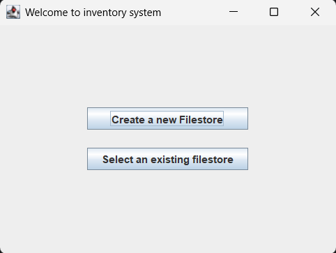
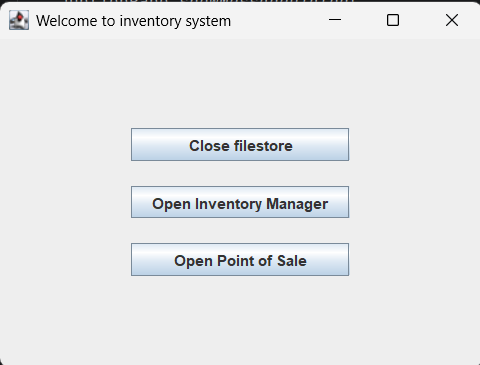
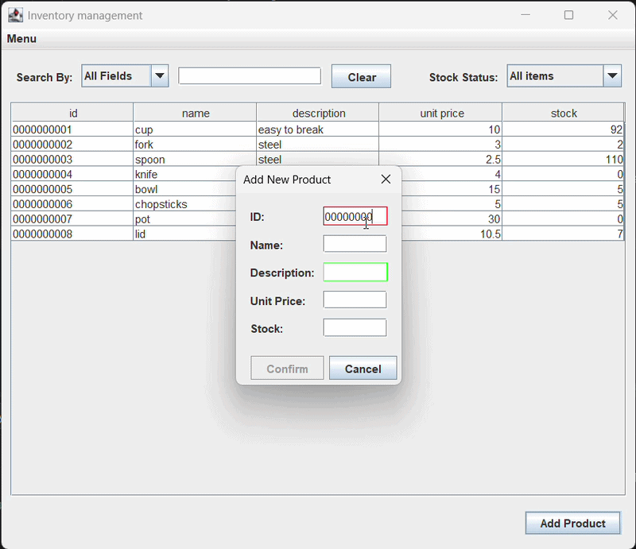
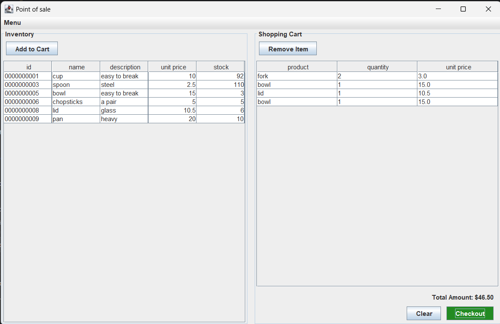

# 🛒 Swing Inventory & Point of Sale System

This is an interactive **Inventory Management and Point of Sale (POS) System** developed using Java Swing. This application features a modular architecture that supports smooth screen transitions, an automated file-save mechanism (Auto-save), data validation, and standard receipt generation.

For an optimal user experience, the application has been pre-packaged using `jpackage` into a standalone, portable green-software ZIP archive—**no pre-installed Java runtime environment (JRE) is required** to run it!

---

## 🛠️ Tech Stack & Architecture

* **Programming Language**: Java 17+
* **GUI Framework**: Java Swing
* **Test Unit**: JUnit 5
* **Design Patterns**: Implemented using the **MVP (Model-View-Presenter)** pattern, along with **Adapter** and **Listener** patterns for event handling and data binding.
* **Data Storage**: `.json` file.
* **Deployment Tool**: `jpackage`

---

## 🚀 Key Features

* **Multi-Screen Navigation**: Integrates a "Welcome Screen", "Inventory Manager", and "Point of Sale" into a unified user workflow.
* **Auto-Save**: Any Create, Read, Update, or Delete (CRUD) operation on the inventory is instantly committed to the designated `.json` file without requiring a manual save button.
* **Data Validation**: Enforces a strict 10-character unique product identifier (uppercase alphanumeric digits only) and validates numerical boundaries for prices and stock counts.
* **Cart Integration Algorithms**:
   * **Cart View**: Combines items *sequentially* as they are added (e.g., adding `A, A, B, A` displays as `A (2), B, A`).
   * **Final Receipt**: Consolidates *all instances* of identical items across the entire transaction into a single row upon checkout (e.g., a cart of `A (3), B, A (2)` yields `A (5)` on the receipt).
* **Format Receipt Generation**: Use `JFileChooser` to prompt the user for a save location and exports a neatly aligned plain-text receipt.

---

## 📸 Screen Demos

### 1. Welcome Screen (Filestore Picker & System Picker) 
<!-- Replace with your actual image paths -->


*Prompted upon startup to either open an existing filestore or create a new one, unlocking the core management and POS modules.*

### 2. Inventory Manager

*Supports searching (by ID, Name, and Description), stock status filtering (All / In-Stock / Out-of-Stock), and ascending/descending column sorting.*

### 3. Point of Sale (POS)

*Displays in-stock items only. Adding items dynamically decrements available stock and merges consecutive selections.*

---

## 📦 Download & Run

Thanks to `jpackage`, you can run this app out-of-the-box on machines without Java installed.

1. Navigate to the [Releases](https://github.com/YourGitHubUsername/YourRepoName/releases) page of this repository.
2. Download the latest `InventoryManager.zip` file.
3. Extract the ZIP archive to any directory on your computer.
4. Open the extracted folder and double-click **`InventoryManager.exe`** (Windows) or the respective executable for your OS to launch!

> ⚠️ **Note**: On your very first run, please select "Create New Filestore" on the Welcome Screen to initialize a new data file before adding products.

---

## 📂 Specifications

### Inventory Field Validation
* **Identifier**: **Exactly 10 characters** long, unique, consisting strictly of numbers and uppercase letters.
* **Product Name**: Name of the item (can't be null).
* **Product Description**: Detailed description of the item.
* **Price per unit**: Numeric floating-point value (greater than or equal to 0).
* **Stock Quantity**: Numeric integer value representing current stock.

### Sample Receipt Layout
The generated `receipt.txt` file uses neat columnar formatting matching the sample below:
```text
--------------------------------
1  PRODUCT_A               $7.50
4  PRODUCT_J    ($1.00)    $4.00
10 PRODUCT_Z   ($15.59)  $155.90
================================
   TOTAL                 $167.40
--------------------------------
```

---
## Author
* **Ching-shing(Deeumiya) Huang**

## License
This project is licensed under the MIT License